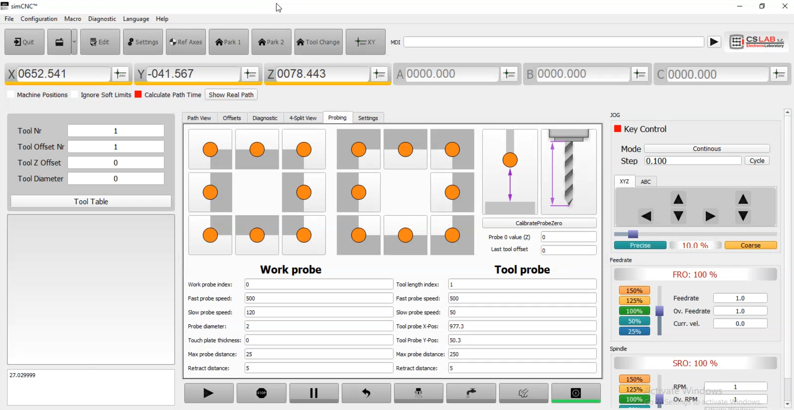

# SimCNC Janis Screen

This is a **Janis_Screen for SimCNC**, designed and created by me.  
It modifies the default interface to better suit my workflow, but others might also find it useful.

> ⚠️ **Safety Notice**  
> This screen includes probing and tool length measurement features that can cause the machine to move automatically.  
> Movements may be unexpected depending on machine configuration or custom code.  
> Always monitor the machine closely when using these functions, and proceed with caution to avoid collisions or damage.

- **Probing functions** for accurate workpiece alignment
- **Tool length measurement** for automatic and precise tool calibration

## Installation
1. Download the files (`Code → Download ZIP`).
2. Extract the ZIP archive on your computer.
3. Copy the folder into your SimCNC `Screens` directory.  
   Example: `C:\Program Files\SimCNC\Screens\Janis_Screen`
4. Start SimCNC and select the new screen from the settings menu.

## Features
- Custom layout optimized for workflow
- Integrated probing functions
- Built-in tool length measurement
- Easy to extend and modify

## Preview

## Author
- **DIY - Bros.**

## License
This project is licensed under the [MIT License](LICENSE).  
Feel free to use and modify it.

